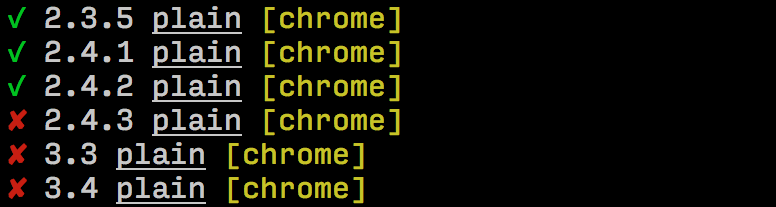

---

layout: sc5

style: |

    #Cover .main-logo__wrapper {
        width: 100%;
        text-align: center;
    }
    #Cover object.main-logo {
        z-index: 5;
        position: static;
        width: 200px;
        margin: 35px 50px;
    }

    #Cover h2 {
        margin:80px 0 0;
        color:#FFF;
        text-align:center;
        font-size:60px;
        line-height: 1.5em;
        }
    #Cover p {
        margin:10px 0 0;
        text-align:center;
        color:#FFF;
        font-size:20px;
        }
        #Cover p a {
            color:#FFF;
            }
    #Picture h2 {
        color:#FFF;
        }
    #SeeMore h2 {
        font-size:100px
        }
    #SeeMore img {
        width:0.72em;
        height:0.72em;
        }
    body {
      font-family: 'PT Sans', sans-serif;
      font-size: 24px;
    }
    .slide h2 {
      font-size: 52px; /* for cyrilic */
    }
    .slide>div {
      font-size: 32px;
      padding-top: 50px;
    }
    .slide ol li,
    .slide ul li {
      text-indent: -1em;
    }
    .shout.slide {
      background-color: #ef4942;
    }
    .shout.slide h2 {
      color: #fff;
    }
    .no-title h2 {
      display: none;
    }
---

# Driving the <b class="sgd">Style Guide Driven</b> Development {#Cover}

    <object class="main-logo" data="themes/sc5/images/logo.min.svg#white" type="image/svg+xml"></object>

*Brought to you by [Varya Stepanova](http://varya.me/) and generated by [Jekyller](https://github.com/shower/jekyller)*
{: .credits }

## Varya Stepanova
{: .varya }

Frontend developer at [SC5](http://sc5.io), Helsinki 
[@varya_en](https://twitter.com/varya_en){: .twitter }

* long-running projects
* UI libraries
* <b>style-guide-driven development</b>
{: .custom-list }

<!--
About keeping things in order.
About programming lazyness.
About not driving a stick.
About robots should work and people should not.
About organizing things for a better life.
About fly lady.
-->

## Progress
{: .shout .progress-chapter }

## Problem
{: .shout }

## Old school way
{: .cycle }

mockup

markup

product

<!--How it used to be-->

## Dash process
{: .dash-process }

### In your dreams

mockup

markup

integration

### In reality

mockup

markup

  
markup

  
mockup

  
markup

 
...over and over again

<!-- TODO: Better colors -->

## Old school way
{: .old-school }

* Inconsistent visual system
* Inconsistent code (duplicate, unreasoned)
* Version confusion
* Time-consuming
* <b>Unmaintainable</b>
{: .list }

<!-- time conhard to edit/change/keep up-to-date)-->

## Solution
{: .shout }

## Websites are systems
{: .anna}

<!-- What we are actually developing -->
> Websites are systems rather than pages and as soon as we
> stop perceiving them as that, the better.
<figcaption>Anna Debenham</figcaption>

## Modular CSS structure

* OOCSS
* SMACSS
* BEM
* Atomic design

or any other modular solution
{: .note }

## Modular CSS process
{: .component-cycle }

## Getting out of your comfort zone
{: .challenge }

## Living Style Guides
{: .living-styleguide }

A <b>living style guide</b> represents UI components of your website with exactly the same styles
that you use across the project.

For example,

* [Lonely Planet's Style Guide](http://rizzo.lonelyplanet.com/styleguide/design-elements/colours)
* [A Pattern Apart](http://patterns.alistapart.com/)
* [Anna Debenham's Style Guide](http://style.maban.co.uk/)

## Style-Guide-Driven Development

Style-Guide <s>can</s> must be an integral part of your development workflow.

<b>Style-Guide-Driven Development</b> is the practice of using the style guide as the focal point for all front-end UI
development tasks.

## The tool we missed
{: .tool }

[styleguide.sc5.io](http://styleguide.sc5.io)

## Easy to start

* `npm install sc5-styleguide`
* CSS, SCSS, SASS, LESS
* Gulp- / Grunt- integrated
* Living style guide
* Documentation in code, KSS-compatible
* Templating (AngularJS directives)

## Use as development playground

* Watching and auto-refreshing
* Related variables and styles
* Variable-component mapping
* Live editing

## For large project
{: .shout }

## Hands-on experience: <b class="lib">UI pattern library</b>
{: .cross-company }

## Visual unit tests
{: .unit-tests }

Before: 

After: 

Test reveals: 

{: .next }

## Automating
{: .automate }

* `gulp test:visual:update` — makes canonical screenshots
* `gulp test:visual` — compares local copy with the canon
{: .test-pic }

### Ready to use with **continuous integration**!

## UI library Style Guide
{: .benefits }

* Living overview of UI
* Quick manual testing
* Unit tests for UI
* Quick built-out of new pages
* {: .unit-4 } Cross-company design consistency
* Cross-team communication
* Communication for remote teams
* {: .unit-2 } Bridges the gap
* {: .main } <b>"Style-guide-driven" mindset</b>

## For small project
{: .shout .small-project }

## Cat's homepage style guide
{: .own-styleguide }

[j.mp/styleguide-small](http://j.mp/styleguide-small){: .article-link }

* Clear what is missing
* Everything is wrong
* Future must be better

## To sum up
{: .shout }

## Mindset metamorphosis
{: .mindset }

###Before

What markup, CSS and JS I need?

### After
What modules is this page made of? Do I need to create new modules? 
**Future modules and pages start in style guide**.

## Thank you!
{: .thanks }

Varya Stepanova, SC5 Online 
[@varya_en](https://twitter.com/varya_en){: .twitter }

### [varya.me/refresh-2015](http://varya.me/refresh-2015/)

